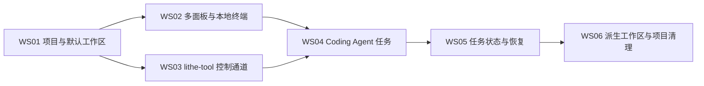

# Lithe 工作流总体交接

## 用途

本文档把已确认的 Lithe 产品设计拆成六个 tracer bullet 垂直工作流，并给出直接
依赖、交付边界和续接入口。本文档不创建或映射独立会话；后续执行者按依赖顺序
自行选择一个工作流开始。

领域术语以 `CONTEXT.md` 为准，产品约束以 `docs/adr/` 为准。本文档不复制这些
来源的完整内容；发生冲突时，优先遵循较新的 ADR 和当前 `AGENTS.md`。

## 当前代码基线

- 应用已经具备 Electron main/preload/renderer 三进程、安全 `contextBridge`、
  Hash 路由、React、SQLite/Drizzle、主题与窗口状态持久化。
- `src/main/database/app-database.ts` 当前只暴露偏好与窗口状态仓储。
- `src/main/ipc-handlers.ts` 当前只处理运行信息和主题 IPC。
- `src/renderer/src/app-shell.tsx` 当前仍是 Home/Settings 导航壳。
- 当前尚无项目、工作区、PTY、面板布局、任务、Agent、文件编辑或 Git Diff
  领域实现。
- `package.json` 已声明 Vitest、Playwright、构建和打包命令，但当前检出中没有
  `tests/` 目录。每个工作流必须建立自己的可执行测试与运行态验收资产，不能引用
  旧记录中的通过状态代替当前证据。
- 当前工作树包含用户已有的未提交改动。开始任何工作流前必须重新检查
  `git status`，保留并绕开不属于该工作流的改动。

共同入口：

- `CONTEXT.md`
- `docs/adr/0001-采用单仓单包与固定工具链.md`
- `docs/adr/0002-以沙箱化三进程和窄通信划分特权边界.md`
- `docs/adr/0003-界面进程采用代码路由与分层状态架构.md`
- `docs/adr/0004-本地持久化采用内置数据库与迁移.md`
- `docs/adr/0005-采用分层测试与真实桌面路径验收.md`
- `docs/adr/0006-构建工具与打包工具分工.md`
- `package.json`
- `electron-builder.yml`
- `src/main/index.ts`
- `src/main/database/app-database.ts`
- `src/main/ipc-handlers.ts`
- `src/preload/index.ts`
- `src/shared/app-contract.ts`
- `src/renderer/src/app-shell.tsx`

## 依赖关系

执行波次：

1. WS01
2. WS02、WS03
3. WS04
4. WS05
5. WS06

直接依赖只表示开始实现前必须完成的工作流。每个工作流仍须在自己的最终代码状态
上独立验证，不能把依赖工作流的旧证据当作本工作流证据。

## 共同执行协议

每个工作流按以下顺序续接：

1. 读取本文档、`CONTEXT.md`、共同 ADR 和本工作流列出的 ADR。
2. 使用 codebase-memory-mcp 重新索引或确认索引状态，再从知识图定位真实代码
   边界；文件系统与当前 Git 状态优先于旧交接记录。
3. 尚有会改变边界的细节时先调用 `/grill-with-docs`，一次确认一个决定。
4. 实现时遵循 `/code-spec`。用户可见前端路径调用 `/e2e`；后端公开行为与稳定
   seam 调用 `/tdd`。混合工作流分别保留两类证据。
5. 完成适用的 `/verifying`，再调用 `/code-review` 同时审查 Standards 与 Spec。
6. 只处理本工作流范围；不提交或覆盖其他工作流及用户已有改动。未经用户明确
   要求不创建分支、不提交、不推送。

视觉工作流在确定页面层级前使用 `/design-philosophy`；需要形成新的视觉表达时再
使用 `/frontend-design`。需要确定深模块 seam 时使用 `/codebase-design`。

### 成熟开源框架优先

实现路径应优先采用知名、活跃维护且许可证兼容的开源框架，Lithe 只在其外部建立
领域适配、权限边界、持久化映射和产品交互。不得自行实现已有成熟方案覆盖的底层
通用能力，尤其包括：

- 终端模拟器、PTY 跨平台封装和终端输入输出协议；
- 标签/拆分布局引擎、拖拽命中与尺寸计算。

每个相关工作流开始实现前，先调研该领域主流框架的官方仓库与文档，至少比较：

- 活跃维护状态、社区采用度和发布稳定性；
- MIT 项目的许可证兼容性；
- Electron、React、Windows/Linux/macOS 兼容性；
- 安全边界、无障碍、性能、包体和打包约束；
- API 是否允许 Lithe 实现 ADR 所需语义，而不 fork 或侵入框架内部。

框架选择应把第三方能力封装在窄 Adapter 后，避免业务模型直接依赖供应商 API。
若现有框架均无法满足需求，必须先用 `/grill-with-docs` 展示调研证据、明确缺口并
形成 ADR；未经该确认不得转为自行实现通用引擎。

## WS01-项目加入与默认工作区

### 定义

- 目标：用户添加已有目录或创建目录后，获得稳定项目身份、默认工作区和可导航的
  应用主壳。
- 一句话描述：把“选择目录”贯穿到 SQLite、main IPC、preload 契约和左侧项目树，
  形成第一个真实项目路径。
- 边界：包含顶部标题栏、左侧导航骨架、项目树、默认工作区、无 Git 检测、基础
  导航持久化和空状态；不包含 Worktree、任务、PTY。
- 直接依赖：无。

### 交付物

- 项目、默认工作区及导航状态的数据库模型、迁移与仓储。
- 受信 sender 校验下的项目选择、目录创建、查询与导航 IPC。
- 顶部标题栏、磨砂左侧导航、项目/工作区树、用户头像与归档入口占位。
- 添加已有目录、创建新目录、重启后恢复项目树的 E2E 资产。

### 完成条件

- 普通目录加入后只产生默认工作区，不执行 `git init`。
- Git 仓库根目录加入后仍只展示实际默认工作区，不把分支虚构为工作区。
- 项目 ID 稳定，工作区名称与 Git 分支分离，重启后选择状态可恢复。
- main/preload/renderer 边界保持窄类型 IPC，Renderer 不获得任意文件系统能力。
- 后端仓储/IPC 测试与真实 Electron 用户路径均通过。

### 建议 Skill

- 开始：`/grill-with-docs`，只补充目录选择和导航交互中尚未写入 ADR 的细节。
- UI：`/design-philosophy`，必要时 `/frontend-design`。
- 实现：`/code-spec`；仓储和 IPC 使用 `/tdd`；添加项目路径使用 `/e2e`。
- 交付：`/verifying`，然后 `/code-review`。

### 上下文

- `docs/adr/0007-以稳定项目身份隔离派生工作区.md`
- `docs/adr/0008-普通文件夹不自动初始化Git.md`
- `docs/adr/0010-工作区以工作目录而非分支为边界.md`
- `docs/adr/0033-工作区名称与Git分支解耦.md`
- `docs/adr/0034-顶部导航兼作平台标题栏.md`
- `docs/adr/0035-左侧导航磨砂材质允许平台降级.md`

### 第一步行动

从知识图追踪 `createAppDatabase`、`registerIpcHandlers` 和 `AppShell`，确定项目聚合
在数据库、main 服务、preload 契约和 Renderer store 中的最小公开 seam。

## WS02-工作区多面板与本地终端

### 定义

- 目标：用户进入工作区后，可以创建本地终端，并通过标签、递归拆分、移动和
  最大化组织持久化布局。
- 一句话描述：把一个普通终端从 PTY 进程贯穿到面板 UI、输入输出和 SQLite 布局
  恢复。
- 边界：包含三平台本机 PTY、Shell 检测、递归布局树、标签组、移动、拆分、
  最大化、布局持久化和退出清理；不包含 Agent。
- 直接依赖：WS01。

### 交付物

- 深模块化的 PTY 管理器及跨平台 ConPTY/Unix PTY 适配。
- 工作区布局模型、SQLite 迁移、恢复器和普通终端面板。
- 多标签、水平/垂直递归拆分、移动标签、源组收拢、最大化/恢复 UI。
- Shell 自动检测与全局默认设置。
- PTY 生命周期、布局约束和真实终端交互的测试/E2E。

### 完成条件

- Windows、Linux、macOS 使用各自本机 PTY，首版没有 SSH、WSL 专用或容器语义。
- 任意层级拆分和标签移动保持面板、PTY 与焦点身份，空组正确收拢。
- SQLite 只保存布局、cwd 和 shell，不保存输出或 scrollback。
- 正常关闭重建布局和新 PTY；临时最大化不持久化。
- 工作区隔离、进程退出和异常 PTY 清理有可重复证据。

### 建议 Skill

- seam 设计：`/codebase-design`。
- 实现：`/code-spec`；PTY/布局不变量使用 `/tdd`；真实输入输出和拖拽路径使用
  `/e2e`。
- UI：`/design-philosophy`。
- 交付：`/verifying`，然后 `/code-review`。

### 上下文

- `docs/adr/0020-工作区直接承载唯一中间主界面.md`
- `docs/adr/0021-任务独立于Agent面板存在.md`
- `docs/adr/0041-布局合并统一建模为移动标签.md`
- `docs/adr/0042-终端拆分创建独立普通终端.md`
- `docs/adr/0043-全屏统一定义为仅UI可用的面板最大化.md`
- `docs/adr/0050-首版终端只支持本机PTY.md`
- `docs/adr/0051-Shell仅自动检测并选择全局默认.md`
- `docs/adr/0052-首版不持久化普通终端输出.md`

### 第一步行动

先调研成熟的终端模拟器、PTY 封装和 React 拆分布局框架，再用
`/codebase-design` 把选定框架封装在 PTY 运行时、持久化布局与 Renderer 面板树
之间的窄 seam；不得自行实现终端模拟器或通用布局引擎。

## WS03-lithe-tool本地控制通道

### 定义

- 目标：Agent 或普通外部终端可以通过全局 `lithe-tool context` 安全查询当前
  Lithe 层级和稳定 ID。
- 一句话描述：打通独立 CLI 到运行中 Electron main 的同用户本地控制链路。
- 边界：包含 `lithe-tool` 可执行入口、Named Pipe/Unix Socket、JSON 协议、
  capability、外部目标解析和审批请求基础设施；领域修改命令由相应后续工作流
  注册。
- 直接依赖：WS01。

### 交付物

- 可全局调用且不与 `Lithe.exe` 冲突的 `lithe-tool`。
- Windows Named Pipe 与 macOS/Linux Unix Domain Socket 服务。
- 单 JSON stdout、稳定错误码、退出码和无敏感信息日志协议。
- Agent capability 与外部终端显式稳定 ID 两种调用上下文。
- `context` 命令及三分钟审批队列的可扩展基础。

### 完成条件

- Lithe 未运行时稳定失败且不自动启动应用；不监听 TCP。
- 外部终端可执行 `context` 并得到当前项目、工作区和任务层级 JSON。
- capability 只能访问绑定上下文，实例停止后立即失效。
- stdout 不混入日志；日志不记录 capability。
- 跨进程真实调用、拒绝伪造上下文和断连清理均有测试证据。

### 建议 Skill

- seam 设计：`/codebase-design`。
- 实现：`/code-spec`；协议、授权、断连和错误码使用 `/tdd`；全局 CLI 到 Electron
  的真实消费者路径使用 `/e2e`。
- 交付：`/verifying`，然后 `/code-review`。

### 上下文

- `docs/adr/0013-CLI任务工具采用最小权限.md`
- `docs/adr/0014-内置工具只提供CLI入口.md`
- `docs/adr/0015-工具权限受当前工作上下文约束.md`
- `docs/adr/0045-lithe-tool固定为十六个命令.md`
- `docs/adr/0046-lithe-tool支持Agent与外部终端调用.md`
- `docs/adr/0047-lithe-tool管理命令统一输出JSON.md`
- `docs/adr/0048-破坏性CLI命令等待三分钟UI审批.md`

### 第一步行动

确定 CLI 包装、main 控制服务与领域命令注册表的最小接口，并先实现只读 `context`
端到端路径，避免提前铺开十六个空命令。

## WS04-Coding-Agent任务

### 定义

- 目标：用户创建命名任务后，Lithe 使用全局默认 Adapter 启动、绑定、停止、恢复
  或 fork 对应 Agent 会话。
- 一句话描述：打通任务创建、Agent 面板、CLI 进程、会话 ID 和声明式 Adapter。
- 边界：包含任务基础模型、Agent 面板、内置/自定义 Adapter、不可变 Adapter
  版本、Agent Skill 安装以及 `task create|rename` 和全部 `agent` 命令；不包含
  未读、运行、归档组织与系统通知。
- 直接依赖：WS02、WS03。

### 交付物

- 任务、Agent 会话、Adapter 与 Adapter 版本的迁移和仓储。
- 内置 Codex/Claude Code Adapter、用户自定义声明式 Adapter 设置。
- 全局默认选择、可用性检测、start/resume/stop/fork 执行器。
- Agent 面板、PTY 关联和 `agent bind` 幂等绑定。
- Lithe Tool Skill 权威副本及 Codex/Claude 受管发现入口。
- `task create|rename`、`agent bind|start|resume|stop|fork` 命令处理器。

### 完成条件

- 创建任务要求唯一名称和可用全局默认 Adapter，并自动启动 Agent。
- 任务固定创建时的 Adapter 版本；修改或删除配置不破坏已有任务恢复。
- 一个任务只有一个 Agent 会话和至多一个 Agent 面板；关闭面板不停止 Agent。
- bind 不解析终端输出或提供方历史；同 ID 幂等，不同 ID 拒绝。
- fork 创建同工作区新任务并按 `-\d` 命名，不创建 Worktree。
- Claude Code 使用公开 `--resume ... --fork-session`；不支持能力时禁用而不模拟。
- Skill 安装不覆盖同名用户文件；Codex/Claude 和确定性测试 Adapter 路径可验证。

### 建议 Skill

- 开始：`/grill-with-docs`，只解决 Adapter 配置 UI 和进程错误呈现等未确认细节。
- seam 设计：`/codebase-design`。
- 实现：`/code-spec`；Adapter、绑定和进程状态机使用 `/tdd`；创建、停止、恢复、
  fork 的真实面板路径使用 `/e2e`。
- 交付：`/verifying`，然后 `/code-review`。

### 上下文

- `docs/adr/0019-任务创建依赖可用的全局默认CLI.md`
- `docs/adr/0021-任务独立于Agent面板存在.md`
- `docs/adr/0024-Agent派生与工作区派生相互独立.md`
- `docs/adr/0025-CLIAdapter按能力降级且不提供重启.md`
- `docs/adr/0026-Agent会话ID通过工具显式绑定.md`
- `docs/adr/0027-首版CLIAdapter仅支持声明式配置.md`
- `docs/adr/0028-内置与自定义Adapter使用同一声明模型.md`
- `docs/adr/0029-任务固定不可变Adapter版本.md`
- `docs/adr/0030-任务名称唯一且fork追加层级后缀.md`
- `docs/adr/0056-删除任务不删除提供方Agent历史.md`
- `docs/adr/0059-Claude-Code通过公开参数派生Agent会话.md`
- `docs/adr/0060-Lithe不代管Coding-Agent-CLI安装与认证.md`
- `docs/adr/0061-未配置全局默认Adapter时由用户选择.md`
- `docs/adr/0062-lithe-tool通过Agent-Skill说明调用契约.md`

### 第一步行动

先用确定性假 CLI 定义 Adapter 执行器和 Agent 会话状态机的契约，再将 Codex 与
Claude Code 建模为同一声明接口的数据。

## WS05-任务组织状态与恢复

### 定义

- 目标：用户能够跨工作区管理任务的关注、运行、归档、删除、置顶、通知和启动
  恢复。
- 一句话描述：把 Agent 事件贯穿到任务状态、左侧导航、归档页、系统通知和进程
  恢复。
- 边界：包含正交任务状态、归档、删除、置顶工作区、全局搜索、无项目临时工作区、
  通知、惰性恢复与退出确认；不包含 Git Worktree 生命周期。
- 直接依赖：WS04。

### 交付物

- 关注事件、CLI 实例运行标记、生命周期和置顶记录。
- 完整左侧任务树、置顶工作区、归档页、搜索和底部入口。
- `task unread|running|idle|archive|delete` 命令处理器与审批接入。
- 临时工作区及最后任务删除时的回收站清理。
- 正常/异常退出、最后可见工作区、惰性 Agent 恢复和系统通知。

### 完成条件

- 已读/未读、运行、生命周期相互正交；删除不是状态。
- 前台真正可见才更新已读；后台未读通知不包含 Agent 内容并按任务合并。
- 运行标记按 CLI 实例隔离，实例退出兜底清理。
- 运行中任务不能归档；归档关闭 PTY、保留布局且恢复时不自动启动 Agent。
- 关闭主窗口即退出；运行任务需要确认；异常退出下次恢复前再次确认。
- 无项目任务不暴露工作区容器，最后任务删除时整目录进入回收站。

### 建议 Skill

- 实现：`/code-spec`；状态机、时间比较、恢复和清理使用 `/tdd`；导航、归档、
  通知和退出确认使用 `/e2e`。
- UI：`/design-philosophy`。
- 交付：`/verifying`，然后 `/code-review`。

### 上下文

- `docs/adr/0012-任务状态采用正交维度.md`
- `docs/adr/0013-CLI任务工具采用最小权限.md`
- `docs/adr/0016-归档任务关闭PTY但保留布局.md`
- `docs/adr/0017-运行状态采用CLI实例级标记.md`
- `docs/adr/0018-显式选中才更新任务已读时间.md`
- `docs/adr/0022-正常启动自动恢复已打开的Agent.md`
- `docs/adr/0023-关闭主窗口即退出应用.md`
- `docs/adr/0031-无项目任务由隐藏临时工作区承载.md`
- `docs/adr/0032-最后一个无项目任务删除时回收临时目录.md`
- `docs/adr/0053-启动恢复最后可见工作区.md`
- `docs/adr/0057-CLI管理命令不改变界面焦点.md`
- `docs/adr/0058-后台未读发送无内容系统通知.md`

### 第一步行动

先以“后台 Agent 标记未读，用户点击通知返回任务”为 tracer bullet，固定事件、
时间和可见性 seam，再扩展归档、删除与恢复。

## WS06-派生工作区与项目清理

### 定义

- 目标：用户可以从提交或已有分支创建受管 Worktree，并安全删除工作区、移除项目
  或处理无效项目。
- 一句话描述：把 Git Worktree 操作贯穿到工作区记录、任务清理、UI 确认和
  `lithe-tool workspace` 命令。
- 边界：包含 Worktree 创建、重命名、删除、项目移除、未合并提交确认、无效项目
  与所有 `workspace` 命令；不发现或操作外部 Worktree。
- 直接依赖：WS05。

### 交付物

- Git 仓库检测与受管 Worktree 服务。
- `workspace create|rename|delete` 命令及 UI 等价操作。
- 派生工作区路径、分支/提交校验、脏工作树与未合并提交门禁。
- 移除项目、无效项目恢复和忘记无效项目流程。
- 文件系统、Git 引用和 SQLite 元数据的失败一致性处理。

### 完成条件

- 新分支与已有分支两种创建方式统一进入 `workspace create`，且只从明确提交派生。
- staged、unstaged、untracked 不复制；创建前展示并确认遗漏改动。
- 只管理 `~/.lithe/worktree/...` 下由 Lithe 创建的 Worktree。
- 删除要求已停止且工作树干净；未合并提交要求输入完整分支名。
- 移除项目保留根目录，清理全部受管派生工作区；失败时保留数据库记录。
- 根目录缺失只标记无效，不扫描或重定位；原路径恢复后自动恢复有效标记。
- 使用临时 Git 仓库进行创建、失败回滚、删除和外部 Worktree 忽略验收。

### 建议 Skill

- seam 设计：`/codebase-design`。
- 实现：`/code-spec`；Git/文件系统事务边界使用 `/tdd`；创建、确认、删除和无效
  项目用户路径使用 `/e2e`。
- 交付：`/verifying`，然后 `/code-review`。

### 上下文

- `docs/adr/0007-以稳定项目身份隔离派生工作区.md`
- `docs/adr/0009-派生工作区仅继承明确提交.md`
- `docs/adr/0010-工作区以工作目录而非分支为边界.md`
- `docs/adr/0011-删除派生工作区同时删除分支.md`
- `docs/adr/0033-工作区名称与Git分支解耦.md`
- `docs/adr/0044-工作区创建统一为一个命令.md`
- `docs/adr/0048-破坏性CLI命令等待三分钟UI审批.md`
- `docs/adr/0049-移除项目保留根目录但清理派生工作区.md`
- `docs/adr/0054-项目根目录缺失时只标记无效.md`
- `docs/adr/0055-无效项目可被忘记但不承诺清理Git引用.md`

### 第一步行动

以临时 Git 仓库实现“从 HEAD 创建新分支 Worktree”的单一路径，先固定受管路径、
Git 调用和数据库写入的失败一致性，再增加删除与项目移除。

## 总体完成条件

六个工作流全部完成时：

- 所有直接依赖均有当前代码状态下的完成证据。
- `lithe-tool` 十六个命令都由所属领域工作流接入同一控制服务，没有第二套业务
  实现。
- Windows、Linux、macOS 的适用构建与本机 PTY 路径得到验证；平台降级行为符合
  ADR。
- `pnpm run format:check`、`pnpm run lint`、`pnpm run typecheck`、
  `pnpm run test`、`pnpm run build` 和适用的 `pnpm run test:e2e` 均真实执行。
- 打包产物仍只包含运行所需文件和迁移资源；不因新增 CLI、Skill、PTY 或测试资产
  泄露 capability、终端输出、认证信息或用户文件。
- 最终 `/code-review` 没有未解决的 Standards 或 Spec 阻断项。

本文档只负责工作流关系和总体交接，不授权创建新会话、分支、提交或推送。
